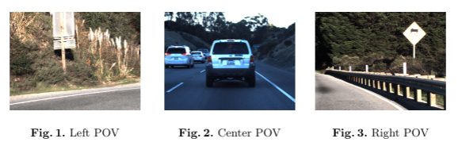
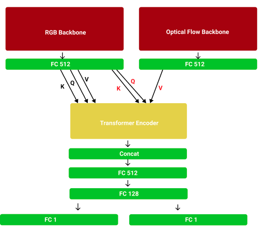
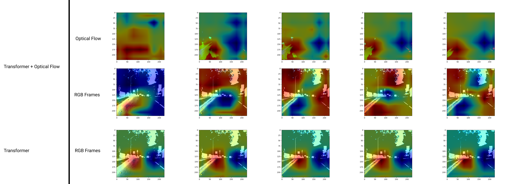

# Self-Driving Car Steering Angle Prediction: Let Transformer Be a Car Again.
[Technical Report](https://github.com/chingisooinar/AI_self-driving-car/blob/main/Technical_Report.pdf)
## Requirements

- Pytorch ≥ 1.7
- Numpy
- Opencv
- Pandas
- wandb
- easydict

## Data
 

- Download the dataset from: [https://github.com/udacity/self-driving-car/tree/master/datasets/CH2](https://github.com/udacity/self-driving-car/tree/master/datasets/CH2)
- Extract images and csv from .bag files: https://github.com/rwightman/udacity-driving-reader

## How to train

### Sequence Models:

1. change easydict parameters in [sequence_train.py](https://github.com/chingisooinar/AI_self-driving-car/blob/main/sequence_train.py)
2. run: python [sequence_train.py](https://github.com/chingisooinar/AI_self-driving-car/blob/main/sequence_train.py)

### CNN Models:

1. change easydict parameters in [dave2_tlearning_train.py](https://github.com/chingisooinar/AI_self-driving-car/blob/main/dave2_tlearning_train.py)
2. run: python [dave2_tlearning_train.py](https://github.com/chingisooinar/AI_self-driving-car/blob/main/dave2_tlearning_train.py)

## Evaluation Data

Download ground truth predictions from [https://github.com/udacity/self-driving-car/tree/master/challenges/challenge-2](https://github.com/udacity/self-driving-car/tree/master/challenges/challenge-2)

## Evaluation

### Sequence Models:

1. change easydict parameters in [sequence_eval.py](https://github.com/chingisooinar/AI_self-driving-car/blob/main/sequence_eval.py)
2. run: python [sequence_eval.py](https://github.com/chingisooinar/AI_self-driving-car/blob/main/sequence_eval.py)

### CNN Models:

1. change easydict parameters in [eval_regular.py](https://github.com/chingisooinar/AI_self-driving-car/blob/main/eval_regular.py)
2. run: python [eval_regular.py](https://github.com/chingisooinar/AI_self-driving-car/blob/main/eval_regular.py)

Get prediction json file and evaluate using [eval.ipynb](https://github.com/chingisooinar/AI_self-driving-car/blob/main/eval.ipynb)
# Checkpoints
[Download here](https://1drv.ms/u/s!Ao7oEpuQjECYmBJhwN6VsEzw8ZCY?e=DKfd6d)
# Architecture

# Performance

# Attention Maps
 
# YouTube

[https://youtu.be/NeJRwUgqKdQ](https://youtu.be/NeJRwUgqKdQ)
